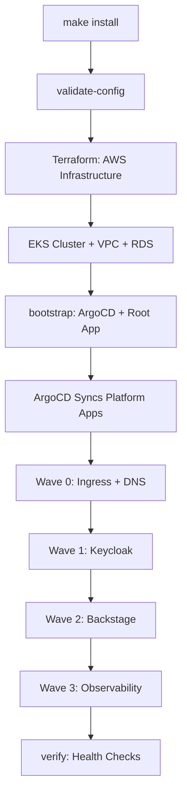

# Internal Developer Platform (IDP) - AWS Reference Implementation

Complete, production-ready Internal Developer Platform built on AWS EKS with GitOps, self-service capabilities, and enterprise-grade security.

## 🎯 What's Included

### Infrastructure Layer
- **EKS Cluster** - Kubernetes 1.33 with managed nodes
- **Karpenter** - Intelligent node autoscaling with spot instances (70% cost savings)
- **VPC** - Multi-AZ networking with private/public subnets
- **RDS PostgreSQL** - Managed database for Keycloak
- **Network Load Balancer** - High-performance ingress

### Platform Layer
- **ArgoCD** - GitOps continuous delivery
- **Keycloak** - Identity and access management (SSO/OIDC)
- **ingress-nginx** - HTTP/HTTPS routing
- **External DNS** - Automatic DNS management
- **AWS Load Balancer Controller** - Native AWS integration

### Application Layer
- **Backstage** - Developer portal with software catalog
- **Crossplane** - Infrastructure APIs (optional)

## 🚀 Quick Start

### Prerequisites

- AWS Account with appropriate permissions
- AWS CLI configured
- Required CLI tools: `aws`, `kubectl`, `helm`, `yq`, `jq`, `gomplate`
- Terraform >= 1.0
- kubectl >= 1.28
- Helm >= 3.9

### Installation (Single Command)

```bash
# 1. Clone repository
git clone <your-repo>
cd reference-implementation-aws

# 2. Configure (customize for your environment)
cp config.yaml.example config.yaml
vim config.yaml  # Set domain, cluster_name, gitops.repo_url, etc.

# 3. Set required environment variables (secrets)
export GITHUB_TOKEN="ghp_xxxxx"  # For private GitOps repo
export KEYCLOAK_ADMIN_PASSWORD="changeme"
export ARGOCD_CLIENT_SECRET="$(openssl rand -hex 32)"
export BACKSTAGE_CLIENT_SECRET="$(openssl rand -hex 32)"

# 4. Check CLI tools
make doctor

# 5. Optional: Pre-flight check (dry-run mode - no warnings about existing resources)
make preflight-dry-run

# 6. Install everything (single command!)
make install

# Done! Access your platform:
# - ArgoCD: https://argocd.yourdomain.com
# - Keycloak: https://keycloak.yourdomain.com
# - Backstage: https://backstage.yourdomain.com
```

### Installation Steps

The `make install` command runs these steps automatically:

1. **validate-config** - Validates `config.yaml` and environment variables
2. **terraform** - Provisions AWS infrastructure (EKS, VPC, RDS, etc.)
3. **bootstrap** - Installs ArgoCD and applies root App-of-Apps
4. **verify** - Checks installation health and endpoints

After bootstrap, ArgoCD automatically syncs all platform applications via GitOps.

**Note:** `make install` will **NEVER** destroy existing resources. To start from scratch, explicitly run `make clean` first.

### Verify Installation

```bash
# Check installation status
make verify

# Or manually check ArgoCD applications
kubectl -n argocd get applications
```

### Installation from Scratch

To install from a completely clean state (destroy and rebuild):

```bash
# 1. Pre-flight check (dry-run - validates prerequisites without warnings)
make preflight-dry-run

# 2. Destroy existing cluster (if any)
make clean

# 3. Install everything
make install

# 4. Verify installation
make verify
```

**Important:** Always run `make clean` explicitly before a fresh installation. The install process will never automatically destroy existing resources.

### Troubleshooting

See [docs/TROUBLESHOOTING.md](docs/TROUBLESHOOTING.md) for common issues and solutions.

**Quick checks:**
```bash
# Check CLI tools
make doctor

# Pre-flight validation (dry-run - no warnings about existing resources)
make preflight-dry-run

# Pre-flight validation (full - shows warnings about existing resources)
make preflight

# Verify installation
make verify
```

### What Gets Installed



## 📁 Repository Structure

```
reference-implementation-aws/
├── Makefile                 # 🚀 Single-command installation
├── config.yaml              # 🔧 Configuration (gitignored - never commit!)
├── config.yaml.example     # 📋 Configuration template
│
├── cluster/                 # ☁️ Infrastructure
│   └── terraform/           # AWS resources (VPC, EKS, RDS, etc)
│
├── platform/                # 🎯 Platform components (Helm values templates)
│   ├── argocd/              # GitOps operator
│   ├── keycloak/            # Identity provider
│   ├── ingress-nginx/       # Ingress controller
│   └── external-dns/        # DNS automation
│
├── argocd-apps/             # 🔄 GitOps Applications
│   ├── root-app.yaml.tpl    # Root App-of-Apps
│   └── platform/            # Platform applications
│       ├── ingress-nginx.yaml.tpl
│       ├── external-dns.yaml.tpl
│       ├── keycloak.yaml.tpl
│       ├── backstage.yaml.tpl
│       └── prometheus.yaml.tpl
│
├── scripts/                 # 🛠️ Installation scripts
│   ├── pre-flight-check.sh  # Pre-installation validation (supports --dry-run)
│   ├── validate-config.sh   # Config validation
│   ├── install-infra.sh     # Terraform wrapper
│   ├── bootstrap-kubernetes.sh  # ArgoCD bootstrap
│   ├── verify-installation.sh   # Health checks
│   ├── destroy-cluster.sh   # Complete cleanup
│   └── utils.sh            # Shared utility functions
│
└── docs/                    # 📚 Documentation
```

## 🛠️ Available Scripts

### Core Installation Scripts

These scripts are used by the Makefile for installation:

- **`pre-flight-check.sh`** - Validates prerequisites before installation
  - Supports `--dry-run` mode to validate without warnings about existing resources
  - Usage: `./scripts/pre-flight-check.sh [--dry-run]` or `make preflight`
- **`validate-config.sh`** - Validates `config.yaml` structure and required fields
- **`install-infra.sh`** - Provisions AWS infrastructure via Terraform
- **`bootstrap-kubernetes.sh`** - Installs ArgoCD and applies root App-of-Apps
- **`verify-installation.sh`** - Checks installation health and endpoints
- **`destroy-cluster.sh`** - Complete cleanup (removes all resources)
- **`utils.sh`** - Shared utility functions for other scripts

### Utility Scripts

These scripts are available for maintenance and operations:

- **`get-urls.sh`** - Get platform component URLs
- **`health-check.sh`** - Health checks for platform components
- **`list-my-resources.sh`** - List AWS resources
- **`manage-users.sh`** - Manage Keycloak users
- **`refresh-backstage-catalog.sh`** - Refresh Backstage catalog
- **`render-argocd-apps.sh`** - Render ArgoCD applications
- **`render-templates.sh`** - Render configuration templates
- **`setup-env.sh`** - Setup environment variables
- **`update-github-token.sh`** - Update GitHub token
- **`create-config-secrets.sh`** - Create configuration secrets
- **`create-gitops-repo.sh`** - Create GitOps repository
- **`create-keycloak-test-user.sh`** - Create test user in Keycloak
- **`cleanup-crds.sh`** - Cleanup Custom Resource Definitions

### Validation Scripts

- **`validate-auth.sh`** - Validate authentication setup
- **`validate-backend.sh`** - Validate backend services
- **`validate-manifests.sh`** - Validate Kubernetes manifests
- **`validate-argocd-oidc.sh`** - Validate ArgoCD OIDC configuration

## 🔧 Configuration

### Configuration File

All non-sensitive configuration is in `config.yaml` (gitignored - never commit!):

```yaml
# Required fields
domain: "yourdomain.com"
cluster_name: "my-idp-cluster"
region: "us-east-1"
gitops:
  repo_url: "https://github.com/<org>/<repo>"
  revision: "main"
```

### Environment Variables (Secrets)

**Never commit secrets!** Set them as environment variables:

```bash
export GITHUB_TOKEN="ghp_xxxxx"              # For private GitOps repo
export KEYCLOAK_ADMIN_PASSWORD="changeme"   # Keycloak admin password
export ARGOCD_CLIENT_SECRET="$(openssl rand -hex 32)"      # OIDC client secret
export BACKSTAGE_CLIENT_SECRET="$(openssl rand -hex 32)"   # OIDC client secret
```

### Configuration Details

All configuration is centralized in `config.yaml`:

```yaml
# Cluster settings
cluster_name: "my-idp-cluster"
region: "us-east-1"
aws_profile: "my-profile"

# Networking
domain: "example.com"
enable_nlb: "true"

# Platform components
use_karpenter: "true"
karpenter:
  version: "1.8.5"
  instance_types: ["t3a.medium", "t3.medium"]
  capacity_type: "spot"

# Identity provider
identity_provider: "keycloak"
keycloak:
  enabled: "true"
  admin_password: "changeme"

# Tags (required for cost tracking)
tags:
  cloud_economics: "Darede-PROJECT::vertical"
  env: "prod"
```

## 📖 Documentation

- [Installation Guide](docs/INSTALLATION.md) - Detailed setup instructions
- [Architecture](docs/ARCHITECTURE.md) - System design and decisions
- [Customization](docs/CUSTOMIZATION.md) - How to adapt for your needs
- [Troubleshooting](docs/TROUBLESHOOTING.md) - Common issues and solutions

## 🎓 Usage Examples

### Deploy a New Application

```bash
# 1. Create Backstage template
# 2. Click "Create" in Backstage UI
# 3. ArgoCD automatically deploys to EKS
# 4. Karpenter scales nodes as needed
```

### Access Components

```bash
# Get cluster credentials
aws eks update-kubeconfig --name $(cd cluster/terraform && terraform output -raw cluster_name)

# View running pods
kubectl get pods -A

# Check Karpenter nodes
kubectl get nodepools
```

### Update Platform

```bash
# Update config.yaml
vim config.yaml

# Re-run installer (idempotent)
make install
```

## 💰 Cost Optimization

- **Karpenter with Spot Instances**: ~70% reduction vs on-demand
- **Auto-scaling**: Pay only for what you use
- **RDS db.t4g.micro**: Minimal cost for POC/dev
- **Single-AZ for dev**: Multi-AZ for production

**Estimated Monthly Cost (POC):**
- EKS Control Plane: $73
- EC2 (2x t3a.small + spot): $30-40
- RDS (db.t4g.micro): $15-18
- NLB: $22
- **Total: ~$140-150/month**

## 🔐 Security Features

- ✅ IMDSv2 required
- ✅ Private subnets for workloads
- ✅ Secrets in AWS Secrets Manager
- ✅ Pod Identity (IRSA) for AWS access
- ✅ Encrypted EBS volumes
- ✅ TLS everywhere
- ✅ Keycloak for SSO/OIDC

## 🤝 Contributing

1. Fork the repository
2. Create a feature branch
3. Make your changes
4. Test with `make preflight-dry-run` and `make install`
5. Submit a pull request

## 📝 License

MIT License - see [LICENSE](LICENSE) for details

## 🆘 Support

- Issues: [GitHub Issues](https://github.com/your-org/repo/issues)
- Docs: [Documentation Site](https://docs.example.com)
- Slack: `#platform-team`

---

**Built with ❤️ by the Platform Team**
