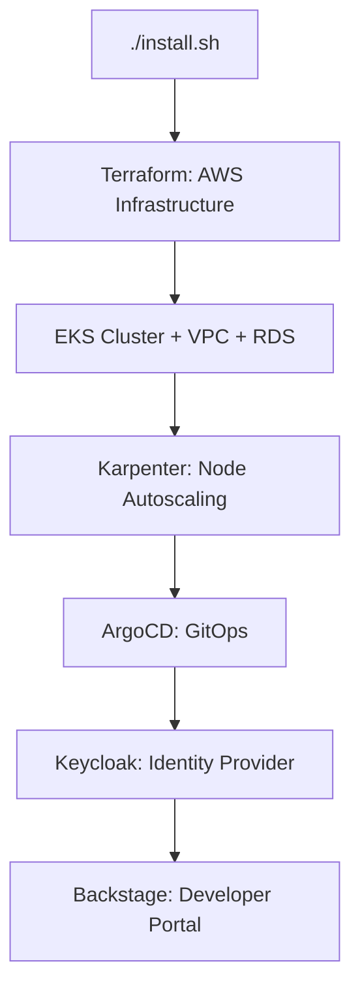

# Internal Developer Platform (IDP) - AWS Reference Implementation

Complete, production-ready Internal Developer Platform built on AWS EKS with GitOps, self-service capabilities, and enterprise-grade security.

## 🎯 What's Included

### Infrastructure Layer
- **EKS Cluster** - Kubernetes 1.33 with managed nodes
- **Karpenter** - Intelligent node autoscaling with spot instances (70% cost savings)
- **VPC** - Multi-AZ networking with private/public subnets
- **RDS PostgreSQL** - Managed database for Keycloak
- **Network Load Balancer** - High-performance ingress

### Platform Layer
- **ArgoCD** - GitOps continuous delivery
- **Keycloak** - Identity and access management (SSO/OIDC)
- **ingress-nginx** - HTTP/HTTPS routing
- **External DNS** - Automatic DNS management
- **AWS Load Balancer Controller** - Native AWS integration

### Application Layer
- **Backstage** - Developer portal with software catalog
- **Crossplane** - Infrastructure APIs (optional)

## 🚀 Quick Start

### Prerequisites

- AWS Account with appropriate permissions
- AWS CLI configured
- Terraform >= 1.0
- kubectl >= 1.28
- Helm >= 3.9
- yq and jq installed

### Installation (15-20 minutes)

```bash
# 1. Clone repository
git clone <your-repo>
cd reference-implementation-aws

# 2. Configure (customize for your environment)
cp config.yaml.example config.yaml
vim config.yaml

# 3. Install everything
./install.sh

# Done! Access your platform:
# - Backstage: https://backstage.yourdomain.com
# - ArgoCD: https://argocd.yourdomain.com
# - Keycloak: https://keycloak.yourdomain.com
```

### What Gets Installed



## 📁 Repository Structure

```
reference-implementation-aws/
├── config.yaml              # 🔧 Configuration (single source of truth)
├── install.sh               # 🚀 One-shot installer
│
├── cluster/                 # ☁️ Infrastructure
│   └── terraform/           # AWS resources (VPC, EKS, RDS, etc)
│
├── platform/                # 🎯 Platform components
│   ├── karpenter/           # Node autoscaler
│   ├── argocd/              # GitOps operator
│   └── keycloak/            # Identity provider
│
├── apps/                    # 🎨 Applications
│   ├── backstage/           # Developer portal
│   └── crossplane/          # Infrastructure APIs
│
├── scripts/                 # 🛠️ Utilities
│   ├── install-karpenter.sh
│   └── generate-karpenter-manifests.sh
│
└── docs/                    # 📚 Documentation
```

## 🔧 Configuration

All configuration is centralized in `config.yaml`:

```yaml
# Cluster settings
cluster_name: "my-idp-cluster"
region: "us-east-1"
aws_profile: "my-profile"

# Networking
domain: "example.com"
enable_nlb: "true"

# Platform components
use_karpenter: "true"
karpenter:
  version: "1.8.5"
  instance_types: ["t3a.medium", "t3.medium"]
  capacity_type: "spot"

# Identity provider
identity_provider: "keycloak"
keycloak:
  enabled: "true"
  admin_password: "changeme"

# Tags (required for cost tracking)
tags:
  cloud_economics: "Darede-PROJECT::vertical"
  env: "prod"
```

## 📖 Documentation

- [Installation Guide](docs/INSTALLATION.md) - Detailed setup instructions
- [Architecture](docs/ARCHITECTURE.md) - System design and decisions
- [Customization](docs/CUSTOMIZATION.md) - How to adapt for your needs
- [Troubleshooting](docs/TROUBLESHOOTING.md) - Common issues and solutions

## 🎓 Usage Examples

### Deploy a New Application

```bash
# 1. Create Backstage template
# 2. Click "Create" in Backstage UI
# 3. ArgoCD automatically deploys to EKS
# 4. Karpenter scales nodes as needed
```

### Access Components

```bash
# Get cluster credentials
aws eks update-kubeconfig --name $(cd cluster/terraform && terraform output -raw cluster_name)

# View running pods
kubectl get pods -A

# Check Karpenter nodes
kubectl get nodepools
```

### Update Platform

```bash
# Update config.yaml
vim config.yaml

# Re-run installer (idempotent)
./install.sh
```

## 💰 Cost Optimization

- **Karpenter with Spot Instances**: ~70% reduction vs on-demand
- **Auto-scaling**: Pay only for what you use
- **RDS db.t4g.micro**: Minimal cost for POC/dev
- **Single-AZ for dev**: Multi-AZ for production

**Estimated Monthly Cost (POC):**
- EKS Control Plane: $73
- EC2 (2x t3a.small + spot): $30-40
- RDS (db.t4g.micro): $15-18
- NLB: $22
- **Total: ~$140-150/month**

## 🔐 Security Features

- ✅ IMDSv2 required
- ✅ Private subnets for workloads
- ✅ Secrets in AWS Secrets Manager
- ✅ Pod Identity (IRSA) for AWS access
- ✅ Encrypted EBS volumes
- ✅ TLS everywhere
- ✅ Keycloak for SSO/OIDC

## 🤝 Contributing

1. Fork the repository
2. Create a feature branch
3. Make your changes
4. Test with `./install.sh --dry-run`
5. Submit a pull request

## 📝 License

MIT License - see [LICENSE](LICENSE) for details

## 🆘 Support

- Issues: [GitHub Issues](https://github.com/your-org/repo/issues)
- Docs: [Documentation Site](https://docs.example.com)
- Slack: `#platform-team`

---

**Built with ❤️ by the Platform Team**
