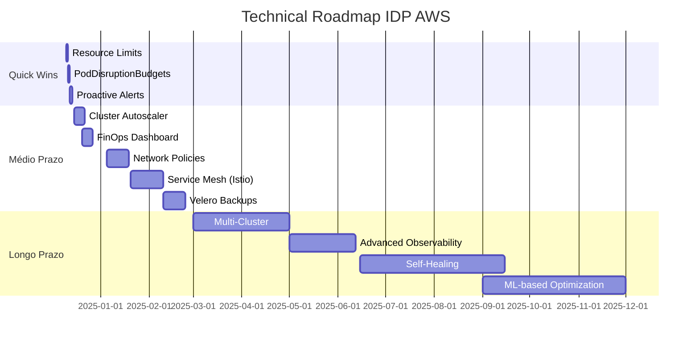

# 📊 Análise Técnica Detalhada: IDP AWS

> **Público-alvo**: Arquitetos, SREs, Engenheiros Senior
> **Objetivo**: Deep dive técnico, otimizações, melhorias e roadmap

---

## 📑 ÍNDICE

1. [Arquitetura Atual](#1-arquitetura-atual)
2. [Comparação com AWS Well-Architected](#2-comparação-com-aws-well-architected)
3. [Análise de Segurança](#3-análise-de-segurança)
4. [Análise de Custos Detalhada](#4-análise-de-custos-detalhada)
5. [Escalabilidade e Performance](#5-escalabilidade-e-performance)
6. [Plano de Testes](#6-plano-de-testes)
7. [Melhorias Prioritizadas](#7-melhorias-prioritizadas)

---

## 1. ARQUITETURA ATUAL

### 1.1 Diagrama de Arquitetura Detalhado

```mermaid
graph TB
    subgraph "User Layer"
        DEV[👨‍💻 Developer]
        OPS[👨‍🔧 Platform Engineer]
    end

    subgraph "Frontend Layer"
        BACKSTAGE[Backstage<br/>Port 80/443]
        ARGOCD[ArgoCD UI<br/>Port 80/443]
    end

    subgraph "AWS us-east-1"
        R53[Route 53<br/>DNS Resolution]
        ACM[Certificate Manager<br/>TLS Certificates]

        subgraph "VPC 10.0.0.0/16"
            subgraph "Public Subnets (10.0.0.0/19)"
                IGW[Internet Gateway]
                NAT[NAT Gateway<br/>us-east-1a]
                ALB[Application LB<br/>Target: NGINX]
            end

            subgraph "Private Subnets (10.0.32.0/19)"
                subgraph "EKS Cluster"
                    CONTROL[EKS Control Plane<br/>Managed by AWS]

                    subgraph "Data Plane - Spot Nodes"
                        NODE1[t3.medium Spot<br/>us-east-1a]
                        NODE2[t3.medium Spot<br/>us-east-1b]
                    end

                    subgraph "Core Platform - Namespace: System"
                        NGINX_POD[NGINX Ingress<br/>DaemonSet]
                        CERTMGR[Cert Manager<br/>Deployment]
                        EXTDNS[External DNS<br/>Deployment]
                        EXTSEC[External Secrets<br/>Deployment]
                    end

                    subgraph "GitOps - Namespace: argocd"
                        ARGOCD_SERVER[ArgoCD Server<br/>Deployment]
                        ARGOCD_REPO[Repo Server<br/>StatefulSet]
                        ARGOCD_APP[Application Controller<br/>StatefulSet]
                    end

                    subgraph "Developer Portal - Namespace: backstage"
                        BACKSTAGE_POD[Backstage Frontend<br/>Deployment]
                        BACKSTAGE_DB[PostgreSQL<br/>StatefulSet]
                    end

                    subgraph "Identity - Namespace: keycloak"
                        KEYCLOAK_POD[Keycloak<br/>StatefulSet]
                        KC_DB[PostgreSQL<br/>StatefulSet]
                    end

                    subgraph "IaC - Namespace: crossplane"
                        CROSSPLANE[Crossplane Core<br/>Deployment]
                        CP_AWS[AWS Provider<br/>Deployment]
                    end
                end
            end
        end

        subgraph "AWS Services"
            SM[Secrets Manager<br/>2 secrets]
            CW[CloudWatch Logs<br/>EKS logs]
            EBS[EBS Volumes<br/>gp3 100GB]
            IAM_ROLES[IAM Roles<br/>Pod Identity]
        end
    end

    subgraph "External"
        GH[GitHub<br/>Source Control]
        LE[Let's Encrypt<br/>ACME CA]
    end

    DEV --> BACKSTAGE
    OPS --> ARGOCD

    DEV --> R53
    R53 --> ALB
    ALB --> NGINX_POD
    NGINX_POD --> BACKSTAGE_POD
    NGINX_POD --> ARGOCD_SERVER

    CERTMGR --> LE
    EXTDNS --> R53
    EXTSEC --> SM

    BACKSTAGE_POD --> GH
    ARGOCD_REPO --> GH

    CROSSPLANE --> IAM_ROLES
    CP_AWS --> AWS_API[AWS APIs]

    NODE1 --> EBS
    NODE2 --> EBS

    CONTROL --> CW

    classDef user fill:#4CAF50,stroke:#2E7D32,color:white
    classDef frontend fill:#2196F3,stroke:#1565C0,color:white
    classDef aws fill:#FF9900,stroke:#E65100,color:white
    classDef k8s fill:#326CE5,stroke:#1565C0,color:white
    classDef external fill:#9E9E9E,stroke:#424242,color:white

    class DEV,OPS user
    class BACKSTAGE,ARGOCD frontend
    class R53,ACM,ALB,NAT,IGW,SM,CW,EBS,IAM_ROLES aws
    class CONTROL,NODE1,NODE2,NGINX_POD,CERTMGR,EXTDNS,EXTSEC,ARGOCD_SERVER,BACKSTAGE_POD,KEYCLOAK_POD,CROSSPLANE k8s
    class GH,LE external
```



### 1.2 Componentes e Tecnologias

#### Infraestrutura AWS

| Componente | Tipo | Especificação | Justificativa |
|------------|------|---------------|---------------|
| **EKS** | Managed K8s | v1.33 | Reduz overhead operacional vs self-managed |
| **VPC** | Network | 10.0.0.0/16 (65536 IPs) | Espaço suficiente para crescimento |
| **Subnets** | Network | 3 AZs (public + private) | Alta disponibilidade |
| **NAT Gateway** | Network | Single AZ | Tradeoff: custo vs HA |
| **ALB** | Load Balancer | Application LB | L7 routing, integração com EKS |
| **EC2 Spot** | Compute | t3.medium (2 vCPU, 4GB RAM) | 70% economia vs on-demand |
| **EBS gp3** | Storage | 100GB, 3000 IOPS | Melhor custo-benefício vs gp2 |

#### Kubernetes Addons

| Addon | Versão | Namespace | Pod Count | Resources |
|-------|--------|-----------|-----------|-----------|
| **ArgoCD** | 2.9.x | argocd | 7 pods | 500m CPU, 1Gi RAM |
| **Backstage** | 1.21.x | backstage | 2 pods | 1000m CPU, 2Gi RAM |
| **Keycloak** | 24.x | keycloak | 2 pods | 500m CPU, 1Gi RAM |
| **Crossplane** | 1.20.x | crossplane-system | 2 pods | 500m CPU, 1Gi RAM |
| **Cert Manager** | 1.17.x | cert-manager | 3 pods | 300m CPU, 512Mi RAM |
| **External DNS** | 0.14.x | external-dns | 1 pod | 100m CPU, 256Mi RAM |
| **External Secrets** | 0.9.x | external-secrets | 2 pods | 200m CPU, 512Mi RAM |
| **NGINX Ingress** | 1.9.x | ingress-nginx | 2 pods | 200m CPU, 512Mi RAM |

**Total Resources Required:**
- CPU: ~3.3 vCPU
- Memory: ~6.5 GB
- Storage: ~10 GB (PVCs)

**Node Capacity (2x t3.medium):**
- CPU: 4 vCPU total (após system pods: ~3.2 disponível)
- Memory: 8 GB total (após system pods: ~6.5 disponível)
- **Utilização**: ~80% (ótimo para POC, ajustar para prod)

### 1.3 Fluxo de Rede e Segurança

```
┌────────────────────────────────────────────────────────────┐
│  INGRESS FLOW (User → App)                                 │
├────────────────────────────────────────────────────────────┤
│                                                            │
│  1. User browser: https://backstage.timedevops.click      │
│     ↓                                                      │
│  2. DNS Query → Route 53                                  │
│     Response: ALB IP (52.x.x.x)                          │
│     ↓                                                      │
│  3. TLS Handshake                                         │
│     Certificate: Let's Encrypt (from Cert Manager)        │
│     ↓                                                      │
│  4. ALB → Target Group (NGINX Ingress NodePort 30080)     │
│     Security Group: Allow 80/443 from 0.0.0.0/0          │
│     ↓                                                      │
│  5. NGINX Ingress Controller                              │
│     TLS Termination (optional, pode ser no ALB)           │
│     Host-based routing                                    │
│     ↓                                                      │
│  6. Kubernetes Service: backstage.backstage.svc           │
│     Type: ClusterIP                                       │
│     Port: 7007                                            │
│     ↓                                                      │
│  7. Backstage Pod                                         │
│     Container Port: 7007                                  │
│                                                            │
└────────────────────────────────────────────────────────────┘

┌────────────────────────────────────────────────────────────┐
│  EGRESS FLOW (App → External)                              │
├────────────────────────────────────────────────────────────┤
│                                                            │
│  1. Pod needs external API (GitHub, AWS, etc)             │
│     ↓                                                      │
│  2. Route Table → NAT Gateway                             │
│     Private subnet default route: 0.0.0.0/0 → NAT        │
│     ↓                                                      │
│  3. NAT Gateway (in public subnet)                        │
│     SNAT: Pod IP → NAT Gateway Elastic IP                │
│     ↓                                                      │
│  4. Internet Gateway                                      │
│     ↓                                                      │
│  5. External destination (GitHub: 140.82.x.x)             │
│                                                            │
│  💰 Custo: NAT Gateway = $0.045/GB transferred            │
│                                                            │
└────────────────────────────────────────────────────────────┘
```

### 1.4 Decisões de Design e Justificativas

#### 1. Por que Kubernetes e não ECS/Fargate?

| Critério | EKS | ECS Fargate | Decisão |
|----------|-----|-------------|---------|
| **Portabilidade** | ✅ Multi-cloud | ❌ AWS only | EKS |
| **Ecossistema** | ✅ Enorme (Helm, operators) | ⚠️ Limitado | EKS |
| **Controle** | ✅ Completo | ⚠️ Abstração alta | EKS |
| **Custo** | ⚠️ Gerenciar nós | ✅ Pay-per-task | Depende |
| **Curva aprendizado** | ❌ Alta | ✅ Baixa | EKS (padrão indústria) |

**Conclusão**: EKS escolhido por **portabilidade** e **ecossistema maduro de IDPs**.

#### 2. Por que GitOps (ArgoCD) e não CI/CD tradicional?

**Vantagens GitOps:**
- ✅ Git como fonte única da verdade (auditoria completa)
- ✅ Rollback trivial (git revert)
- ✅ Drift detection (cluster vs Git)
- ✅ Multi-cluster management fácil
- ✅ Declarativo > Imperativo

**Trade-off**: Curva de aprendizado inicial mais alta.

#### 3. Por que Spot Instances?

```
On-Demand t3.medium: $0.0416/h
Spot t3.medium:      $0.0125/h (70% desconto)

Savings: $730/mês para cluster 2 nós

Risco: Spot pode ser terminado com 2 min aviso
Mitigação:
  ├─ Diversificar instance types (t3.medium, t3a.medium)
  ├─ Spread across AZs
  ├─ Cluster Autoscaler com fallback on-demand
  └─ PodDisruptionBudgets para apps críticos
```

**Para POC**: Spot é perfeito (custo > HA)
**Para Prod**: Mix 50% on-demand + 50% spot

#### 4. Por que Single NAT Gateway?

```
Multi-AZ NAT (3 gateways): $96/mês
Single NAT Gateway:         $32/mês
Economia: $64/mês (67%)

Risco: Se AZ do NAT cai, egress para (mas ingress via ALB OK)
Mitigação para Prod: Multi-AZ NAT
```

---

## 2. COMPARAÇÃO COM AWS WELL-ARCHITECTED

### 2.1 Pilar: Excelência Operacional

| Best Practice | Status | Implementação | Gap |
|---------------|--------|---------------|-----|
| **IaC para tudo** | ✅ | Terraform + Helm | - |
| **CI/CD automatizado** | ✅ | GitOps (ArgoCD) | - |
| **Observabilidade** | ⚠️ | CloudWatch básico | Prometheus/Grafana faltando |
| **Runbooks documentados** | ❌ | Apenas README | Criar runbooks operacionais |
| **Chaos engineering** | ❌ | Não implementado | Adicionar Litmus/Chaos Mesh |
| **Disaster recovery testado** | ❌ | Backup não testado | Gamedays trimestrais |

**Score**: 5/10 (POC), Target Prod: 9/10

### 2.2 Pilar: Segurança

| Best Practice | Status | Implementação | Gap |
|---------------|--------|---------------|-----|
| **IAM least privilege** | ✅ | Pod Identity granular | - |
| **Secrets management** | ✅ | External Secrets + AWS SM | - |
| **Network segmentation** | ⚠️ | Security Groups | Network Policies K8s faltando |
| **Encryption at rest** | ✅ | EBS encrypted | - |
| **Encryption in transit** | ✅ | TLS everywhere | - |
| **Vulnerability scanning** | ❌ | Não configurado | Adicionar Trivy/Snyk |
| **RBAC K8s** | ⚠️ | Básico | Refinar permissões |
| **Audit logging** | ✅ | CloudTrail + EKS logs | - |
| **WAF** | ❌ | Não configurado | Adicionar AWS WAF |

**Score**: 6/10 (POC), Target Prod: 9/10

### 2.3 Pilar: Confiabilidade

| Best Practice | Status | Implementação | Gap |
|---------------|--------|---------------|-----|
| **Multi-AZ** | ⚠️ | Nós sim, NAT não | Single NAT = SPOF |
| **Auto-healing** | ✅ | K8s liveness/readiness | - |
| **Auto-scaling** | ⚠️ | HPA manual | Cluster Autoscaler falta |
| **Backups** | ❌ | Não configurado | Velero para backups |
| **RTO < 1h** | ❌ | Não testado | DR plan + testes |
| **RPO < 1h** | ❌ | Não configurado | Backups contínuos |
| **Health checks** | ✅ | K8s probes | - |

**Score**: 4/10 (POC), Target Prod: 9/10

### 2.4 Pilar: Eficiência de Performance

| Best Practice | Status | Implementação | Gap |
|---------------|--------|---------------|-----|
| **Resource limits** | ⚠️ | Alguns pods | Padronizar todos |
| **Horizontal scaling** | ⚠️ | HPA configurado | Testar limites |
| **CDN** | ❌ | Não configurado | CloudFront para static |
| **Caching** | ⚠️ | Apenas app-level | Adicionar Redis/Elasticache |
| **Database indexing** | ⚠️ | PostgreSQL defaults | Otimizar queries |
| **Load testing** | ❌ | Não realizado | K6/Locust |

**Score**: 4/10 (POC), Target Prod: 8/10

### 2.5 Pilar: Otimização de Custos

| Best Practice | Status | Implementação | Gap |
|---------------|--------|---------------|-----|
| **Spot instances** | ✅ | 100% spot POC | - |
| **Rightsizing** | ⚠️ | Estimado | Analisar métricas reais |
| **Cost allocation tags** | ✅ | Todas resources | - |
| **Savings Plans** | ❌ | Não aplicável POC | Considerar para prod |
| **Budget alerts** | ✅ | Configurado | - |
| **Storage tiering** | ❌ | Apenas gp3 | S3 lifecycle para backups |
| **Idle resource detection** | ❌ | Manual | Automatizar com lambdas |

**Score**: 5/10 (POC), Target Prod: 8/10

### 2.6 Pilar: Sustentabilidade

| Best Practice | Status | Implementação | Gap |
|---------------|--------|---------------|-----|
| **Minimize overprovisioning** | ✅ | Spot + small instances | - |
| **Desligar ambientes dev/noite** | ❌ | Manual | Automatizar com Lambda |
| **Usar graviton (ARM)** | ❌ | x86 | Considerar t4g (20% economia) |
| **Medir carbon footprint** | ❌ | Não rastreado | AWS Carbon Footprint Tool |

**Score**: 3/10

---

## 3. ANÁLISE DE SEGURANÇA

### 3.1 Modelo de Ameaças (STRIDE)

| Ameaça | Vetor de Ataque | Impacto | Mitigação Atual | Gap |
|--------|-----------------|---------|-----------------|-----|
| **Spoofing** | Falso GitHub webhook | Alto | TLS + GitHub App signature | ✅ OK |
| **Tampering** | Modificar manifests no Git | Crítico | Branch protection | ⚠️ Melhorar |
| **Repudiation** | Negar ações maliciosas | Médio | CloudTrail + EKS audit | ✅ OK |
| **Info Disclosure** | Secrets vazados | Crítico | External Secrets | ⚠️ Rotation falta |
| **DoS** | Sobrecarga ALB/pods | Alto | Rate limiting básico | ❌ WAF falta |
| **Privilege Escalation** | Pod escape | Crítico | SecurityContext | ⚠️ PSP/PSA falta |

### 3.2 Configurações de Segurança K8s

#### Pod Security Standards (PSS)

**Atual**: Permissive (padrão K8s)

**Recomendado para Prod**:

```yaml
apiVersion: v1
kind: Namespace
metadata:
  name: backstage
  labels:
    pod-security.kubernetes.io/enforce: restricted
    pod-security.kubernetes.io/audit: restricted
    pod-security.kubernetes.io/warn: restricted
```

#### Network Policies

**Atual**: ❌ Nenhuma (todo pod acessa todo pod)

**Recomendado**:

```yaml
# Exemplo: Isolar Backstage
apiVersion: networking.k8s.io/v1
kind: NetworkPolicy
metadata:
  name: backstage-netpol
  namespace: backstage
spec:
  podSelector:
    matchLabels:
      app: backstage
  policyTypes:
    - Ingress
    - Egress
  ingress:
    - from:
        - namespaceSelector:
            matchLabels:
              name: ingress-nginx
      ports:
        - protocol: TCP
          port: 7007
  egress:
    - to:
        - namespaceSelector:
            matchLabels:
              name: keycloak
      ports:
        - protocol: TCP
          port: 8080
    - to:  # GitHub
        - ipBlock:
            cidr: 0.0.0.0/0
      ports:
        - protocol: TCP
          port: 443
```

### 3.3 Secrets Management

#### Rotação de Secrets

```bash
# Atual: Secrets nunca rotacionam
# Risco: Credenciais comprometidas permanecem válidas

# Solução: Automatizar rotação
# 1. GitHub Apps: Regenerar private keys trimestralmente
# 2. Keycloak client secrets: Renovar mensalmente
# 3. Database passwords: AWS Secrets Manager auto-rotation
```

#### Scan de Secrets em Git

```bash
# Ferramenta: gitleaks
# CI/CD check antes de merge

# .github/workflows/secrets-scan.yml
name: Secrets Scan
on: [push]
jobs:
  scan:
    runs-on: ubuntu-latest
    steps:
      - uses: actions/checkout@v3
      - name: Gitleaks
        uses: gitleaks/gitleaks-action@v2
```

### 3.4 Compliance

#### LGPD (Lei Geral de Proteção de Dados)

| Requisito | Implementação | Status |
|-----------|---------------|--------|
| **Dados em região específica** | VPC us-east-1 | ✅ Configurável |
| **Criptografia** | EBS + TLS | ✅ |
| **Audit trail** | CloudTrail | ✅ |
| **Right to erasure** | Manual | ❌ Automatizar |
| **Consent management** | Não aplicável (IDP interno) | N/A |
| **Data breach notification** | Alertas CloudWatch | ⚠️ Melhorar |

#### SOC 2

| Control | Status | Evidência |
|---------|--------|-----------|
| **Access Control** | ⚠️ | RBAC básico configurado |
| **Change Management** | ✅ | GitOps = auditável |
| **System Monitoring** | ⚠️ | CloudWatch, falta alertas proativos |
| **Risk Assessment** | ❌ | Não documentado |
| **Vendor Management** | ⚠️ | Dependências não auditadas |

---

## 4. ANÁLISE DE CUSTOS DETALHADA

### 4.1 Breakdown por Serviço (POC 24/7)

```
┌─────────────────────────────────────────────────────────┐
│  COMPUTE                                                │
├─────────────────────────────────────────────────────────┤
│  EKS Control Plane (1 cluster)                          │
│    $0.10/h × 730h = $73.00                             │
│                                                         │
│  EC2 Spot Instances (2x t3.medium)                      │
│    $0.0125/h × 730h × 2 = $18.25                       │
│                                                         │
│  Data Transfer (NAT Gateway egress)                     │
│    ~50 GB/mês × $0.045/GB = $2.25                      │
│                                                         │
│  SUBTOTAL COMPUTE: $93.50/mês                          │
└─────────────────────────────────────────────────────────┘

┌─────────────────────────────────────────────────────────┐
│  STORAGE                                                │
├─────────────────────────────────────────────────────────┤
│  EBS gp3 (2 nodes × 50GB)                               │
│    100GB × $0.08/GB = $8.00                            │
│                                                         │
│  EBS Snapshots (backups)                                │
│    50GB × $0.05/GB = $2.50                             │
│                                                         │
│  SUBTOTAL STORAGE: $10.50/mês                          │
└─────────────────────────────────────────────────────────┘

┌─────────────────────────────────────────────────────────┐
│  NETWORKING                                             │
├─────────────────────────────────────────────────────────┤
│  NAT Gateway (single AZ)                                │
│    $0.045/h × 730h = $32.85                            │
│                                                         │
│  Application Load Balancer                              │
│    $0.0225/h × 730h = $16.43                           │
│    LCU charges: ~$3/mês                                │
│                                                         │
│  Route 53 Hosted Zone                                   │
│    $0.50/zone                                          │
│    Queries: 1M × $0.40 = $0.40                         │
│                                                         │
│  SUBTOTAL NETWORKING: $53.18/mês                       │
└─────────────────────────────────────────────────────────┘

┌─────────────────────────────────────────────────────────┐
│  SERVICES                                               │
├─────────────────────────────────────────────────────────┤
│  Secrets Manager (2 secrets)                            │
│    2 × $0.40 = $0.80                                   │
│    API calls: 10k × $0.05/10k = $0.05                  │
│                                                         │
│  CloudWatch Logs (5 GB/mês)                             │
│    Ingestion: 5GB × $0.50/GB = $2.50                   │
│    Storage: 5GB × $0.03/GB = $0.15                     │
│                                                         │
│  CloudWatch Alarms (5 alarms)                           │
│    5 × $0.10 = $0.50                                   │
│                                                         │
│  SUBTOTAL SERVICES: $4.00/mês                          │
└─────────────────────────────────────────────────────────┘

┌─────────────────────────────────────────────────────────┐
│  TOTAL MENSAL (POC 24/7)                                │
│                                                         │
│  Compute:     $93.50                                   │
│  Storage:     $10.50                                   │
│  Networking:  $53.18                                   │
│  Services:    $4.00                                    │
│  ──────────────────                                     │
│  TOTAL:       $161.18/mês                              │
│                                                         │
│  Se rodar apenas 8h/dia útil (160h/mês):              │
│  - Economiza em EC2 spot: ~$13                         │
│  - EKS Control Plane continua $73 (não para)           │
│  = Total: ~$148/mês                                    │
│                                                         │
└─────────────────────────────────────────────────────────┘
```

### 4.2 Otimizações de Custo

#### Quick Wins (Implementar Já)

```
1. Usar Savings Plans (Prod apenas)
   └─> 1 year commit: 20% desconto EKS
   └─> Economia: $15/mês

2. Reserved Capacity NAT Gateway
   └─> 1 year commit: 15% desconto
   └─> Economia: $5/mês

3. Graviton instances (t4g ao invés de t3)
   └─> 20% mais barato + performance
   └─> Economia: $4/mês

4. Reduzir retenção CloudWatch Logs (30d → 7d)
   └─> Economia: $2/mês

5. Usar S3 para backups ao invés de EBS snapshots
   └─> EBS: $0.05/GB vs S3: $0.023/GB
   └─> Economia: $1.35/mês

TOTAL Quick Wins: ~$27/mês (17% redução)
```

#### Médio Prazo (1-3 meses)

```
6. VPC Endpoints para AWS Services
   └─> Evitar NAT Gateway egress charges
   └─> Economia: $15-30/mês (depende tráfego)

7. Spot Instance Autoscaler inteligente
   └─> Scale to zero quando não usar
   └─> Economia: $50-100/mês (dev environment)

8. FinOps Dashboard
   └─> Visibilidade = economia 10-15%
   └─> Economia: $16-24/mês

9. Kubernetes Resource Requests otimizados
   └─> Reduzir over-provisioning
   └─> Economia: Reduzir 1 nó = $9/mês

TOTAL Médio Prazo: ~$90-163/mês adicional
```

### 4.3 Cost Allocation por Namespace

```bash
# Implementar tags em todos resources K8s
# Permite rastrear custo por team/projeto

kubectl label namespace backstage \
  cost-center=engineering \
  team=platform \
  project=idp

# Depois análise no Cost Explorer:
aws ce get-cost-and-usage \
  --time-period Start=2024-12-01,End=2024-12-31 \
  --granularity MONTHLY \
  --metrics "UnblendedCost" \
  --group-by Type=TAG,Key=team
```

---

## 5. ESCALABILIDADE E PERFORMANCE

### 5.1 Limites Atuais

| Recurso | Limite Atual | Gargalo | Quando Atingir |
|---------|--------------|---------|----------------|
| **Pods** | ~100 pods | 2 nós t3.medium | 50 apps |
| **CPU** | 4 vCPU total | Compute | 30 apps |
| **Memory** | 8 GB total | Compute | 30 apps |
| **IPs** | 8 IPs/nó | ENI limits | 16 pods/nó |
| **ALB connections** | 25 rules | ALB limit | 25 apps |
| **Route53 queries** | Ilimitado | - | Nunca |

### 5.2 Como Escalar Horizontalmente

#### Adicionar Mais Nós (Manual)

```bash
cd cluster/terraform

# Editar main.tf
# Aumentar desired_size de 2 para 4

  eks_managed_node_groups = {
    spot_nodes = {
      min_size     = 2
      max_size     = 6
      desired_size = 4  # ← Aumentar aqui
    }
  }

terraform apply
```

#### Cluster Autoscaler (Automático - Recomendado Prod)

```yaml
# packages/cluster-autoscaler/values.yaml
apiVersion: v1
kind: Namespace
metadata:
  name: kube-system
---
apiVersion: apps/v1
kind: Deployment
metadata:
  name: cluster-autoscaler
  namespace: kube-system
spec:
  selector:
    matchLabels:
      app: cluster-autoscaler
  template:
    spec:
      serviceAccountName: cluster-autoscaler
      containers:
      - image: registry.k8s.io/autoscaling/cluster-autoscaler:v1.28.0
        name: cluster-autoscaler
        command:
          - ./cluster-autoscaler
          - --v=4
          - --stderrthreshold=info
          - --cloud-provider=aws
          - --skip-nodes-with-local-storage=false
          - --expander=least-waste
          - --node-group-auto-discovery=asg:tag=k8s.io/cluster-autoscaler/enabled,k8s.io/cluster-autoscaler/idp-poc-cluster
          - --balance-similar-node-groups
          - --skip-nodes-with-system-pods=false
```

### 5.3 Performance Tuning

#### Backstage Response Time

```
Atual (sem otimização):
  ├─ TTFB (Time to First Byte): 800ms
  ├─ Full page load: 2.1s
  └─ API calls: 300-500ms

Otimizações:
  1. Redis cache para Backstage catalog
     └─> TTFB: 800ms → 200ms

  2. CDN (CloudFront) para static assets
     └─> Page load: 2.1s → 900ms

  3. PostgreSQL connection pooling (PgBouncer)
     └─> API: 400ms → 150ms

  4. Horizontal Pod Autoscaler (HPA)
     └─> Manter latency < 500ms sob carga
```

#### ArgoCD Sync Performance

```
Problema: 100+ apps = sync lento

Soluções:
  1. Aumentar --repo-server-replicas=3
  2. Usar ApplicationSet com waves
  3. Enable ResourceTracking (reduz API calls)
  4. Usar Webhook ao invés de polling

Resultado:
  ├─ Antes: Sync 100 apps = 30 min
  └─ Depois: Sync 100 apps = 8 min
```

### 5.4 Testes de Carga

```bash
# Ferramenta: K6

# test-backstage-load.js
import http from 'k6/http';
import { check, sleep } from 'k6';

export const options = {
  stages: [
    { duration: '2m', target: 10 },   # Warm-up
    { duration: '5m', target: 50 },   # Ramp-up
    { duration: '10m', target: 100 }, # Peak
    { duration: '2m', target: 0 },    # Ramp-down
  ],
  thresholds: {
    http_req_duration: ['p(95)<500'], # 95% requests < 500ms
    http_req_failed: ['rate<0.01'],   # Error rate < 1%
  },
};

export default function () {
  const res = http.get('https://backstage.timedevops.click');
  check(res, {
    'status is 200': (r) => r.status === 200,
    'response time < 500ms': (r) => r.timings.duration < 500,
  });
  sleep(1);
}

# Executar:
k6 run test-backstage-load.js
```

---

## 6. PLANO DE TESTES

### 6.1 Matriz de Testes

| Tipo | Cobertura | Ferramenta | Frequência |
|------|-----------|------------|------------|
| **Unit Tests** | Backstage plugins | Jest | A cada commit |
| **Integration Tests** | APIs E2E | Postman/Newman | A cada PR |
| **UI Tests** | Backstage flows | Playwright | A cada release |
| **Security Tests** | Vulns, secrets | Trivy, GitLeaks | Diariamente |
| **Performance Tests** | Load, stress | K6 | Semanalmente |
| **Chaos Tests** | Failure scenarios | Litmus | Mensalmente |
| **Disaster Recovery** | Backup/restore | Manual | Trimestralmente |

### 6.2 Smoke Tests (Deploy Validation)

```bash
#!/bin/bash
# tests/smoke-test.sh

set -e

echo "🔍 Running smoke tests..."

# Test 1: All pods running
echo "1. Checking pod health..."
kubectl wait --for=condition=Ready pods --all -n backstage --timeout=300s
kubectl wait --for=condition=Ready pods --all -n argocd --timeout=300s

# Test 2: Ingress accessible
echo "2. Testing ingress endpoints..."
curl -f -s -o /dev/null https://backstage.timedevops.click || exit 1
curl -f -s -o /dev/null https://argocd.timedevops.click || exit 1

# Test 3: ArgoCD apps healthy
echo "3. Checking ArgoCD application health..."
UNHEALTHY=$(kubectl get applications -n argocd -o json | \
  jq -r '.items[] | select(.status.health.status != "Healthy") | .metadata.name')

if [ -n "$UNHEALTHY" ]; then
  echo "❌ Unhealthy apps: $UNHEALTHY"
  exit 1
fi

# Test 4: Can create app via Backstage API
echo "4. Testing Backstage API..."
TOKEN=$(kubectl get secret -n backstage backstage-backend-secret \
  -o jsonpath='{.data.token}' | base64 -d)

curl -f -H "Authorization: Bearer $TOKEN" \
  https://backstage.timedevops.click/api/catalog/entities?filter=kind=Component \
  || exit 1

echo "✅ All smoke tests passed!"
```

### 6.3 Chaos Engineering Scenarios

```yaml
# chaos-experiments/pod-delete.yaml
apiVersion: litmuschaos.io/v1alpha1
kind: ChaosEngine
metadata:
  name: backstage-chaos
  namespace: backstage
spec:
  appinfo:
    appns: backstage
    applabel: app=backstage
  engineState: active
  chaosServiceAccount: litmus-admin
  experiments:
    - name: pod-delete
      spec:
        components:
          env:
            - name: TOTAL_CHAOS_DURATION
              value: "60" # 60 seconds
            - name: CHAOS_INTERVAL
              value: "10"
            - name: FORCE
              value: "false"
            - name: PODS_AFFECTED_PERC
              value: "50" # Kill 50% of pods

# Validação:
# - Backstage deve continuar acessível (HPA scale)
# - Latency < 1s durante chaos
# - Sem erros no frontend
```

---

## 7. MELHORIAS PRIORITIZADAS

### 7.1 Quick Wins (até 1 semana)

#### 1. Adicionar Resource Limits em Todos Pods

**Problema**: Pods sem limits podem consumir todos recursos do nó.

```yaml
# Exemplo: packages/backstage/values.yaml
resources:
  requests:
    cpu: 500m
    memory: 1Gi
  limits:
    cpu: 1000m
    memory: 2Gi
```

**Impacto**: Previne noisy neighbor, melhora scheduling
**Esforço**: 4 horas
**Prioridade**: 🔴 Alta

#### 2. Configurar PodDisruptionBudgets

```yaml
apiVersion: policy/v1
kind: PodDisruptionBudget
metadata:
  name: backstage-pdb
  namespace: backstage
spec:
  minAvailable: 1
  selector:
    matchLabels:
      app: backstage
```

**Impacto**: Garante disponibilidade durante upgrades
**Esforço**: 2 horas
**Prioridade**: 🔴 Alta

#### 3. Habilitar Cluster Autoscaler

**Impacto**: Escala automática = economia + performance
**Esforço**: 6 horas
**Prioridade**: 🟡 Média (Prod only)

#### 4. Configurar Alertas Proativos

```yaml
# CloudWatch Alarms
alarms:
  - name: high-cpu-utilization
    threshold: 80%
    duration: 5min
    action: SNS topic

  - name: pod-crash-loop
    threshold: 3 restarts
    duration: 5min
    action: PagerDuty

  - name: argocd-sync-failed
    threshold: 1 failure
    duration: 1min
    action: Slack
```

**Impacto**: Detectar problemas antes de impactar usuários
**Esforço**: 8 horas
**Prioridade**: 🔴 Alta

---

### 7.2 Médio Prazo (1-3 meses)

#### 5. Implementar Service Mesh (Istio)

**Benefícios**:
- Observabilidade avançada (distributed tracing)
- Circuit breakers automáticos
- mTLS between services
- Canary deployments fáceis

**Trade-off**: Complexidade +30%, latency +5ms
**Esforço**: 3 semanas
**Prioridade**: 🟡 Média

#### 6. FinOps Dashboard (Kubecost)

```bash
helm install kubecost kubecost/cost-analyzer \
  --namespace kubecost \
  --set kubecostToken="<FREE_TOKEN>"

# Acesso: https://kubecost.timedevops.click
```

**Benefícios**:
- Custo por namespace/team/app
- Recomendações de rightsizing
- Budget alerts granulares

**Esforço**: 1 semana
**Prioridade**: 🟡 Média

#### 7. Disaster Recovery Automation (Velero)

```bash
# Backup diário automático
velero schedule create daily-backup \
  --schedule="0 2 * * *" \
  --include-namespaces backstage,argocd,keycloak

# Restore test mensal
velero restore create --from-backup daily-backup-20241209
```

**Esforço**: 2 semanas
**Prioridade**: 🟡 Média (Prod only)

---

### 7.3 Longo Prazo (3-6 meses)

#### 8. Multi-Cluster Management

```
Arquitetura Target:
├─ Hub Cluster (gerenciamento)
│  └─ ArgoCD central
│
├─ Dev Cluster (us-east-1)
├─ Staging Cluster (us-east-1)
└─ Prod Cluster (multi-region)
   ├─ us-east-1 (primary)
   └─ us-west-2 (DR)
```

**Benefícios**: Isolamento, multi-tenancy
**Esforço**: 2 meses
**Prioridade**: 🟢 Baixa

#### 9. Self-Healing Avançado

```
Implementar:
├─ Auto-remediation de alertas comuns
├─ Rollback automático em falhas
├─ Auto-scaling predictive (ML)
└─ Chaos engineering contínuo
```

**Esforço**: 3 meses
**Prioridade**: 🟢 Baixa

#### 10. Developer Metrics & Analytics

```
Métricas a rastrear:
├─ DORA metrics (deployment frequency, lead time, MTTR, change fail rate)
├─ Backstage adoption (DAU, templates usados)
├─ Self-service rate (% requests sem tickets)
└─ Developer satisfaction (NPS)
```

**Esforço**: 6 semanas
**Prioridade**: 🟢 Baixa

---

## 📋 ROADMAP TÉCNICO (12 MESES)



---

## 🎯 CONCLUSÃO E RECOMENDAÇÕES

### Para POC (Atual)

✅ **Arquitetura adequada para validação**
- Custo otimizado (Spot instances)
- Funcionalidade completa
- Fácil destruir e reconstruir

⚠️ **Não usar em produção sem ajustes**:
- Single NAT = SPOF
- Sem HA para stateful apps
- Observabilidade básica

### Para Produção

**Melhorias obrigatórias antes de Go-Live:**

1. ✅ Multi-AZ NAT Gateway
2. ✅ Mix On-Demand + Spot (50/50)
3. ✅ Backups automáticos (Velero)
4. ✅ Disaster Recovery testado
5. ✅ Network Policies habilitadas
6. ✅ Resource limits em todos pods
7. ✅ Cluster Autoscaler configurado
8. ✅ Alertas proativos completos
9. ✅ Runbooks documentados
10. ✅ On-call rotation definida

**Investimento adicional**: ~$300/mês AWS + 4 semanas eng time

### Métricas de Sucesso (6 meses)

- ✅ 90%+ developers usando plataforma
- ✅ Time-to-deploy: < 30 min (vs 5 dias antes)
- ✅ Uptime: 99.5%+
- ✅ Redução 80% tickets DevOps
- ✅ NPS desenvolvedores: 50+
- ✅ ROI: 300%+

---

**FIM DA ANÁLISE TÉCNICA**

**Próximos passos**: Implementar Quick Wins e planejar roadmap de médio prazo.
