# Backstage como Plataforma de Provisionamento AWS

Guia passo a passo para usar o Backstage como **plataforma de self-service** para criar recursos AWS via Crossplane.

---

## 🎯 Objetivo

Permitir que desenvolvedores criem recursos AWS (S3, RDS, DynamoDB, etc.) via interface do Backstage, sem precisar conhecer Terraform ou CloudFormation.

**Fluxo:**
```
Desenvolvedor → Backstage Template → Crossplane → AWS Resource criado
```

---

## 📋 Pré-requisitos

✅ Cluster EKS rodando
✅ Backstage instalado e funcionando
✅ ArgoCD instalado
✅ Conta AWS com permissões IAM

---

## 🚀 Passo a Passo Completo

### **Passo 1: Instalar Crossplane no Cluster**

#### 1.1 Adicionar Helm repo do Crossplane

```bash
export AWS_PROFILE=darede

helm repo add crossplane-stable https://charts.crossplane.io/stable
helm repo update
```

#### 1.2 Instalar Crossplane

```bash
helm install crossplane \
  --namespace crossplane-system \
  --create-namespace \
  crossplane-stable/crossplane \
  --wait
```

#### 1.3 Verificar instalação

```bash
kubectl get pods -n crossplane-system

# Deve mostrar:
# crossplane-xxx    Running
# crossplane-rbac-manager-xxx    Running
```

---

### **Passo 2: Instalar AWS Provider no Crossplane**

#### 2.1 Criar arquivo `aws-provider.yaml`

```bash
cat > /tmp/aws-provider.yaml <<EOF
apiVersion: pkg.crossplane.io/v1
kind: Provider
metadata:
  name: provider-aws-s3
spec:
  package: xpkg.upbound.io/upbound/provider-aws-s3:v1.1.0
---
apiVersion: pkg.crossplane.io/v1
kind: Provider
metadata:
  name: provider-aws-rds
spec:
  package: xpkg.upbound.io/upbound/provider-aws-rds:v1.1.0
---
apiVersion: pkg.crossplane.io/v1
kind: Provider
metadata:
  name: provider-aws-dynamodb
spec:
  package: xpkg.upbound.io/upbound/provider-aws-dynamodb:v1.1.0
---
apiVersion: pkg.crossplane.io/v1
kind: Provider
metadata:
  name: provider-aws-ec2
spec:
  package: xpkg.upbound.io/upbound/provider-aws-ec2:v1.1.0
EOF
```

#### 2.2 Aplicar providers

```bash
kubectl apply -f /tmp/aws-provider.yaml
```

#### 2.3 Aguardar providers ficarem healthy

```bash
kubectl get providers

# Aguardar até todos mostrarem HEALTHY=True (pode levar 2-3 minutos)
watch kubectl get providers
```

---

### **Passo 3: Configurar Credenciais AWS no Crossplane**

#### 3.1 Criar AWS credentials

```bash
# Usar suas credenciais AWS
AWS_PROFILE=darede \
  aws configure get aws_access_key_id > /tmp/aws-creds.txt

AWS_PROFILE=darede \
  aws configure get aws_secret_access_key >> /tmp/aws-creds.txt

# Criar secret no formato Crossplane
kubectl create secret generic aws-creds \
  -n crossplane-system \
  --from-file=credentials=/tmp/aws-creds.txt

rm /tmp/aws-creds.txt
```

#### 3.2 Criar `ProviderConfig`

```bash
cat > /tmp/provider-config.yaml <<EOF
apiVersion: aws.upbound.io/v1beta1
kind: ProviderConfig
metadata:
  name: default
spec:
  credentials:
    source: Secret
    secretRef:
      namespace: crossplane-system
      name: aws-creds
      key: credentials
EOF

kubectl apply -f /tmp/provider-config.yaml
```

---

### **Passo 4: Criar Repositório de Templates AWS**

#### 4.1 Criar estrutura de repositório

```bash
mkdir -p ~/backstage-aws-templates
cd ~/backstage-aws-templates

# Estrutura:
# backstage-aws-templates/
# ├── s3-bucket/
# │   ├── template.yaml
# │   └── skeleton/
# ├── rds-postgres/
# │   ├── template.yaml
# │   └── skeleton/
# └── dynamodb-table/
#     ├── template.yaml
#     └── skeleton/
```

---

### **Passo 5: Template S3 Bucket**

#### 5.1 Criar `s3-bucket/template.yaml`

```yaml
apiVersion: scaffolder.backstage.io/v1beta3
kind: Template
metadata:
  name: aws-s3-bucket
  title: AWS S3 Bucket
  description: Provisiona um bucket S3 via Crossplane
  tags:
    - aws
    - s3
    - storage
    - recommended
spec:
  owner: team-platform
  type: resource

  parameters:
    - title: Configuração do Bucket S3
      required:
        - bucketName
        - region
        - owner
      properties:
        bucketName:
          title: Nome do Bucket
          type: string
          description: Nome único do bucket (lowercase, sem underscores)
          pattern: '^[a-z0-9][a-z0-9-]*[a-z0-9]$'
          ui:autofocus: true

        region:
          title: AWS Region
          type: string
          description: Região AWS onde o bucket será criado
          enum:
            - us-east-1
            - us-west-2
            - sa-east-1
          default: us-east-1

        encryption:
          title: Server-Side Encryption
          type: boolean
          description: Habilitar criptografia AES-256
          default: true

        versioning:
          title: Versioning
          type: boolean
          description: Habilitar versionamento de objetos
          default: false

        publicAccess:
          title: Block Public Access
          type: boolean
          description: Bloquear acesso público (recomendado)
          default: true

        owner:
          title: Owner Team
          type: string
          description: Time responsável pelo bucket
          ui:field: OwnerPicker
          ui:options:
            catalogFilter:
              kind: Group

        costCenter:
          title: Cost Center
          type: string
          description: Centro de custo para billing

    - title: Repositório de Infraestrutura
      required:
        - repoUrl
      properties:
        repoUrl:
          title: Infrastructure Repository
          type: string
          description: Repositório onde os manifestos Crossplane serão commitados
          default: github.com?repo=infrastructure&owner=darede-labs

  steps:
    - id: fetch-template
      name: Fetch Crossplane Template
      action: fetch:template
      input:
        url: ./skeleton
        values:
          bucketName: ${{ parameters.bucketName }}
          region: ${{ parameters.region }}
          encryption: ${{ parameters.encryption }}
          versioning: ${{ parameters.versioning }}
          publicAccess: ${{ parameters.publicAccess }}
          owner: ${{ parameters.owner }}
          costCenter: ${{ parameters.costCenter }}

    - id: create-pr
      name: Create Pull Request
      action: publish:github:pull-request
      input:
        repoUrl: ${{ parameters.repoUrl }}
        branchName: add-s3-bucket-${{ parameters.bucketName }}
        title: 'feat: Add S3 bucket ${{ parameters.bucketName }}'
        description: |
          ## S3 Bucket Configuration

          - **Bucket Name:** ${{ parameters.bucketName }}
          - **Region:** ${{ parameters.region }}
          - **Encryption:** ${{ parameters.encryption }}
          - **Versioning:** ${{ parameters.versioning }}
          - **Owner:** ${{ parameters.owner }}

          Provisioned via Backstage Self-Service Platform

    - id: register
      name: Register in Catalog
      action: catalog:register
      input:
        repoContentsUrl: ${{ steps['create-pr'].output.repoContentsUrl }}
        catalogInfoPath: '/s3-buckets/${{ parameters.bucketName }}/catalog-info.yaml'

  output:
    links:
      - title: Pull Request
        url: ${{ steps['create-pr'].output.remoteUrl }}
      - title: View in Catalog
        icon: catalog
        entityRef: ${{ steps.register.output.entityRef }}
```

#### 5.2 Criar `s3-bucket/skeleton/s3-bucket.yaml`

```yaml
apiVersion: s3.aws.upbound.io/v1beta1
kind: Bucket
metadata:
  name: ${{ values.bucketName }}
  labels:
    owner: ${{ values.owner }}
    cost-center: ${{ values.costCenter }}
    managed-by: backstage-crossplane
spec:
  forProvider:
    region: ${{ values.region }}
    
    versioning:
      - enabled: true
    
    
    serverSideEncryptionConfiguration:
      - rule:
          - applyServerSideEncryptionByDefault:
              - sseAlgorithm: AES256
    
    tags:
      Name: ${{ values.bucketName }}
      Owner: ${{ values.owner }}
      CostCenter: ${{ values.costCenter }}
      ManagedBy: Backstage
  providerConfigRef:
    name: default
  deletionPolicy: Delete
---

apiVersion: s3.aws.upbound.io/v1beta1
kind: BucketPublicAccessBlock
metadata:
  name: ${{ values.bucketName }}-public-access-block
spec:
  forProvider:
    bucket: ${{ values.bucketName }}
    blockPublicAcls: true
    blockPublicPolicy: true
    ignorePublicAcls: true
    restrictPublicBuckets: true
    region: ${{ values.region }}
  providerConfigRef:
    name: default

```

#### 5.3 Criar `s3-bucket/skeleton/catalog-info.yaml`

```yaml
apiVersion: backstage.io/v1alpha1
kind: Resource
metadata:
  name: ${{ values.bucketName }}
  description: S3 Bucket provisioned via Crossplane
  annotations:
    aws.amazon.com/region: ${{ values.region }}
    aws.amazon.com/resource-type: s3-bucket
    backstage.io/managed-by-location: url:https://github.com/darede-labs/infrastructure/tree/main/s3-buckets/${{ values.bucketName }}
  tags:
    - aws
    - s3
    - storage
spec:
  type: s3-bucket
  owner: ${{ values.owner }}
  lifecycle: production
  system: platform
  dependsOn:
    - resource:crossplane-aws-provider
```

---

### **Passo 6: Template RDS PostgreSQL**

#### 6.1 Criar `rds-postgres/template.yaml`

```yaml
apiVersion: scaffolder.backstage.io/v1beta3
kind: Template
metadata:
  name: aws-rds-postgres
  title: AWS RDS PostgreSQL
  description: Provisiona banco PostgreSQL RDS via Crossplane
  tags:
    - aws
    - rds
    - postgres
    - database
spec:
  owner: team-platform
  type: resource

  parameters:
    - title: Configuração do Banco de Dados
      required:
        - dbName
        - instanceClass
        - allocatedStorage
        - owner
      properties:
        dbName:
          title: Database Name
          type: string
          description: Nome da instância RDS (lowercase, hífens)
          pattern: '^[a-z0-9-]+$'

        instanceClass:
          title: Instance Class
          type: string
          description: Tipo de instância RDS
          enum:
            - db.t3.micro
            - db.t3.small
            - db.t3.medium
            - db.t3.large
          default: db.t3.small

        allocatedStorage:
          title: Storage (GB)
          type: integer
          description: Tamanho do storage em GB
          minimum: 20
          maximum: 1000
          default: 20

        postgresVersion:
          title: PostgreSQL Version
          type: string
          enum:
            - "14.10"
            - "15.5"
            - "16.1"
          default: "16.1"

        multiAZ:
          title: Multi-AZ
          type: boolean
          description: Deploy em múltiplas AZs (alta disponibilidade)
          default: false

        backupRetention:
          title: Backup Retention (days)
          type: integer
          minimum: 0
          maximum: 35
          default: 7

        owner:
          title: Owner Team
          type: string
          ui:field: OwnerPicker

  steps:
    - id: fetch
      name: Fetch Template
      action: fetch:template
      input:
        url: ./skeleton
        values:
          dbName: ${{ parameters.dbName }}
          instanceClass: ${{ parameters.instanceClass }}
          allocatedStorage: ${{ parameters.allocatedStorage }}
          postgresVersion: ${{ parameters.postgresVersion }}
          multiAZ: ${{ parameters.multiAZ }}
          backupRetention: ${{ parameters.backupRetention }}
          owner: ${{ parameters.owner }}

    - id: pr
      name: Create Pull Request
      action: publish:github:pull-request
      input:
        repoUrl: github.com?repo=infrastructure&owner=darede-labs
        branchName: add-rds-${{ parameters.dbName }}
        title: 'feat: Add RDS PostgreSQL ${{ parameters.dbName }}'
        description: |
          ## RDS Configuration
          - **Instance:** ${{ parameters.dbName }}
          - **Class:** ${{ parameters.instanceClass }}
          - **Storage:** ${{ parameters.allocatedStorage }}GB
          - **Version:** PostgreSQL ${{ parameters.postgresVersion }}
          - **Multi-AZ:** ${{ parameters.multiAZ }}
          - **Owner:** ${{ parameters.owner }}

    - id: register
      name: Register in Catalog
      action: catalog:register
      input:
        repoContentsUrl: ${{ steps.pr.output.repoContentsUrl }}
        catalogInfoPath: '/rds-databases/${{ parameters.dbName }}/catalog-info.yaml'

  output:
    links:
      - title: Pull Request
        url: ${{ steps.pr.output.remoteUrl }}
```

#### 6.2 Criar `rds-postgres/skeleton/rds-instance.yaml`

```yaml
apiVersion: rds.aws.upbound.io/v1beta1
kind: Instance
metadata:
  name: ${{ values.dbName }}
  labels:
    owner: ${{ values.owner }}
    managed-by: backstage-crossplane
spec:
  forProvider:
    region: us-east-1
    instanceClass: ${{ values.instanceClass }}
    allocatedStorage: ${{ values.allocatedStorage }}
    engine: postgres
    engineVersion: "${{ values.postgresVersion }}"
    dbName: ${{ values.dbName | replace("-", "_") }}
    username: postgres
    passwordSecretRef:
      name: ${{ values.dbName }}-password
      namespace: crossplane-system
      key: password
    
    multiAz: true
    
    backupRetentionPeriod: ${{ values.backupRetention }}
    skipFinalSnapshot: true
    publiclyAccessible: false
    storageEncrypted: true
    tags:
      Name: ${{ values.dbName }}
      Owner: ${{ values.owner }}
      ManagedBy: Backstage
  providerConfigRef:
    name: default
  writeConnectionSecretToRef:
    name: ${{ values.dbName }}-connection
    namespace: default
---
apiVersion: v1
kind: Secret
metadata:
  name: ${{ values.dbName }}-password
  namespace: crossplane-system
type: Opaque
stringData:
  password: "ChangeMe123!"  # TODO: Use secret generator
```

---

### **Passo 7: Template DynamoDB Table**

#### 7.1 Criar `dynamodb-table/template.yaml`

```yaml
apiVersion: scaffolder.backstage.io/v1beta3
kind: Template
metadata:
  name: aws-dynamodb-table
  title: AWS DynamoDB Table
  description: Provisiona tabela DynamoDB via Crossplane
  tags:
    - aws
    - dynamodb
    - nosql
spec:
  owner: team-platform
  type: resource

  parameters:
    - title: Configuração da Tabela
      required:
        - tableName
        - hashKey
        - owner
      properties:
        tableName:
          title: Table Name
          type: string
          pattern: '^[a-zA-Z0-9_-]+$'

        hashKey:
          title: Hash Key (Partition Key)
          type: string
          description: Primary key da tabela

        hashKeyType:
          title: Hash Key Type
          type: string
          enum:
            - S  # String
            - N  # Number
          default: S

        rangeKey:
          title: Range Key (Sort Key)
          type: string
          description: Sort key (opcional)

        rangeKeyType:
          title: Range Key Type
          type: string
          enum:
            - S
            - N
          default: S

        billingMode:
          title: Billing Mode
          type: string
          enum:
            - PAY_PER_REQUEST  # On-demand
            - PROVISIONED      # Provisioned capacity
          default: PAY_PER_REQUEST

        owner:
          title: Owner Team
          type: string
          ui:field: OwnerPicker

  steps:
    - id: fetch
      name: Fetch Template
      action: fetch:template
      input:
        url: ./skeleton
        values:
          tableName: ${{ parameters.tableName }}
          hashKey: ${{ parameters.hashKey }}
          hashKeyType: ${{ parameters.hashKeyType }}
          rangeKey: ${{ parameters.rangeKey }}
          rangeKeyType: ${{ parameters.rangeKeyType }}
          billingMode: ${{ parameters.billingMode }}
          owner: ${{ parameters.owner }}

    - id: pr
      name: Create Pull Request
      action: publish:github:pull-request
      input:
        repoUrl: github.com?repo=infrastructure&owner=darede-labs
        branchName: add-dynamodb-${{ parameters.tableName }}
        title: 'feat: Add DynamoDB table ${{ parameters.tableName }}'

    - id: register
      name: Register in Catalog
      action: catalog:register
      input:
        repoContentsUrl: ${{ steps.pr.output.repoContentsUrl }}
        catalogInfoPath: '/dynamodb-tables/${{ parameters.tableName }}/catalog-info.yaml'

  output:
    links:
      - title: Pull Request
        url: ${{ steps.pr.output.remoteUrl }}
```

#### 7.2 Criar `dynamodb-table/skeleton/dynamodb-table.yaml`

```yaml
apiVersion: dynamodb.aws.upbound.io/v1beta1
kind: Table
metadata:
  name: ${{ values.tableName }}
  labels:
    owner: ${{ values.owner }}
    managed-by: backstage-crossplane
spec:
  forProvider:
    region: us-east-1
    billingMode: ${{ values.billingMode }}
    attribute:
      - name: ${{ values.hashKey }}
        type: ${{ values.hashKeyType }}
      
      - name: ${{ values.rangeKey }}
        type: ${{ values.rangeKeyType }}
      
    hashKey: ${{ values.hashKey }}
    
    rangeKey: ${{ values.rangeKey }}
    
    tags:
      Name: ${{ values.tableName }}
      Owner: ${{ values.owner }}
      ManagedBy: Backstage
  providerConfigRef:
    name: default
```

---

### **Passo 8: Fazer Push dos Templates para GitHub**

```bash
cd ~/backstage-aws-templates

git init
git add .
git commit -m "Add AWS resource templates for Backstage"

# Criar repositório no GitHub: darede-labs/backstage-aws-templates
git remote add origin https://github.com/darede-labs/backstage-aws-templates.git
git push -u origin main
```

---

### **Passo 9: Registrar Templates no Backstage**

#### 9.1 Acessar Backstage

```
https://backstage.timedevops.click
Login: admin / admin
```

#### 9.2 Registrar cada template

1. Clicar em **Create** no menu lateral
2. Clicar em **Register Existing Component**
3. Inserir URLs dos templates:

```
https://github.com/darede-labs/backstage-aws-templates/blob/main/s3-bucket/template.yaml

https://github.com/darede-labs/backstage-aws-templates/blob/main/rds-postgres/template.yaml

https://github.com/darede-labs/backstage-aws-templates/blob/main/dynamodb-table/template.yaml
```

4. Clicar **Analyze** → **Import**

---

### **Passo 10: Criar Recurso AWS via Backstage**

#### 10.1 Usar template S3

1. No Backstage, ir em **Create**
2. Selecionar template **AWS S3 Bucket**
3. Preencher formulário:
   - **Bucket Name:** `meu-bucket-teste-123`
   - **Region:** `us-east-1`
   - **Encryption:** ✅
   - **Versioning:** ❌
   - **Block Public Access:** ✅
   - **Owner:** `team-platform`
   - **Cost Center:** `engineering`

4. Clicar **Create**

#### 10.2 O que acontece

1. ✅ **Pull Request criado** no repo `infrastructure`
2. ✅ **Manifest Crossplane** adicionado em `/s3-buckets/meu-bucket-teste-123/`
3. ✅ **Catalog entry** criado para o bucket

#### 10.3 Aprovar e fazer merge do PR

1. Revisar PR no GitHub
2. Merge para `main`
3. ArgoCD detecta mudança e aplica manifesto
4. **Crossplane cria bucket S3 na AWS** ✨

#### 10.4 Verificar recurso criado

```bash
# No Kubernetes - ver managed resource
kubectl get buckets
kubectl describe bucket meu-bucket-teste-123

# Na AWS
aws s3 ls | grep meu-bucket-teste-123
```

---

## 📊 Workflow Completo

```mermaid
graph LR
    A[Desenvolvedor] --> B[Backstage UI]
    B --> C[Preenche Template]
    C --> D[Create PR]
    D --> E[Aprovação]
    E --> F[Merge to main]
    F --> G[ArgoCD Sync]
    G --> H[Crossplane]
    H --> I[AWS Resource Created]
```



---

## 🔧 Configurações Adicionais

### Configurar GitHub Token no Backstage

```bash
# 1. Criar GitHub Personal Access Token
# GitHub → Settings → Developer settings → Personal access tokens
# Scopes: repo, workflow, read:org

# 2. Adicionar ao secret do Backstage
kubectl patch secret backstage-env-vars -n backstage \
  -p '{"data":{"GITHUB_TOKEN":"'$(echo -n "ghp_seu_token_aqui" | base64)'"}}'

# 3. Reiniciar Backstage
kubectl rollout restart deployment/backstage -n backstage
```

### Criar Repositório de Infraestrutura

```bash
# Estrutura recomendada
infrastructure/
├── s3-buckets/
├── rds-databases/
├── dynamodb-tables/
├── vpc/
└── README.md
```

---

## 📚 Recursos AWS Suportados pelo Crossplane

| Recurso | Provider | Exemplo |
|---------|----------|---------|
| **S3 Bucket** | `provider-aws-s3` | Storage de objetos |
| **RDS PostgreSQL** | `provider-aws-rds` | Banco relacional |
| **DynamoDB** | `provider-aws-dynamodb` | NoSQL |
| **VPC** | `provider-aws-ec2` | Networking |
| **EKS Cluster** | `provider-aws-eks` | Kubernetes cluster |
| **Lambda** | `provider-aws-lambda` | Serverless functions |
| **SQS** | `provider-aws-sqs` | Message queue |
| **SNS** | `provider-aws-sns` | Notifications |
| **CloudWatch** | `provider-aws-cloudwatch` | Monitoring |
| **IAM** | `provider-aws-iam` | Roles e policies |

---

## 🎯 Próximos Passos Recomendados

1. ✅ **Instalar Crossplane** (Passo 1-2)
2. ✅ **Configurar AWS credentials** (Passo 3)
3. ✅ **Criar templates S3, RDS, DynamoDB** (Passo 4-7)
4. ✅ **Registrar templates no Backstage** (Passo 9)
5. ✅ **Testar criação de recurso** (Passo 10)
6. 🔄 **Criar templates adicionais** (VPC, Lambda, SQS, etc.)
7. 🔄 **Configurar ArgoCD para auto-sync** do repo de infra
8. 🔄 **Implementar aprovações** via GitHub CODEOWNERS

---

## 🔐 Segurança e Governança

### 1. Aprovações Obrigatórias

Configurar **CODEOWNERS** no repo de infra:

```
# infrastructure/.github/CODEOWNERS
/s3-buckets/**     @darede-labs/platform-team
/rds-databases/**  @darede-labs/database-admins
/dynamodb-tables/** @darede-labs/platform-team
```

### 2. Políticas de Custo

Adicionar validações no template:

```yaml
allocatedStorage:
  maximum: 100  # Máximo 100GB
instanceClass:
  enum:
    - db.t3.micro
    - db.t3.small  # Apenas instâncias pequenas
```

### 3. Tags Obrigatórias

Sempre incluir:
- `Owner`
- `CostCenter`
- `ManagedBy: Backstage`
- `Environment`

---

## 🐛 Troubleshooting

### Crossplane não cria recurso

```bash
# Ver logs do provider
kubectl logs -n crossplane-system -l pkg.crossplane.io/provider=provider-aws-s3

# Ver status do managed resource
kubectl describe bucket nome-do-bucket
```

### Provider não fica HEALTHY

```bash
# Verificar se credentials estão corretas
kubectl get secret aws-creds -n crossplane-system -o yaml

# Recriar provider
kubectl delete provider provider-aws-s3
kubectl apply -f aws-provider.yaml
```

---

## ✅ Checklist de Validação

- [ ] Crossplane instalado e running
- [ ] AWS Providers instalados e HEALTHY
- [ ] ProviderConfig configurado com credentials
- [ ] Templates criados e pushed para GitHub
- [ ] Templates registrados no Backstage
- [ ] Teste de criação de S3 bucket bem-sucedido
- [ ] Bucket visível na AWS console
- [ ] Recurso aparece no Catalog do Backstage

---

**Última atualização:** 11 de Dezembro de 2025
**Versão Crossplane:** v1.14+
**Providers AWS:** Upbound v1.1+
